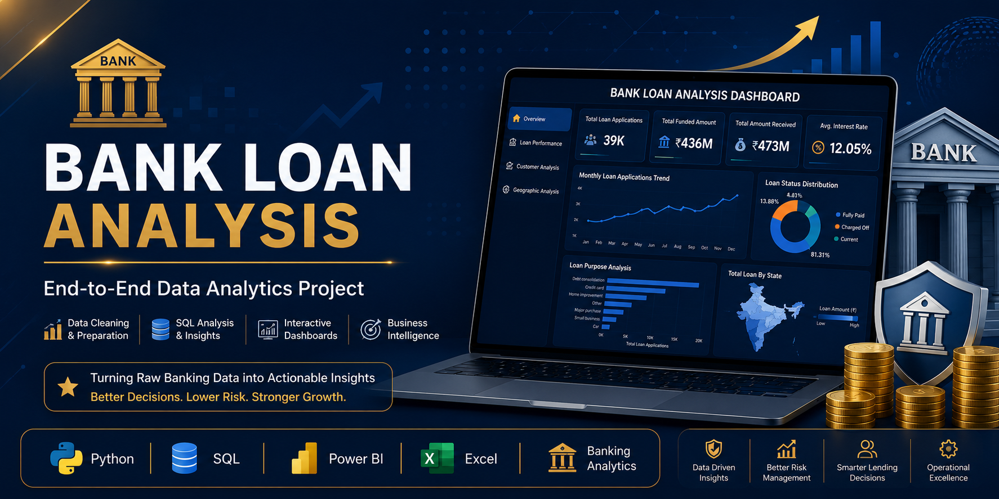
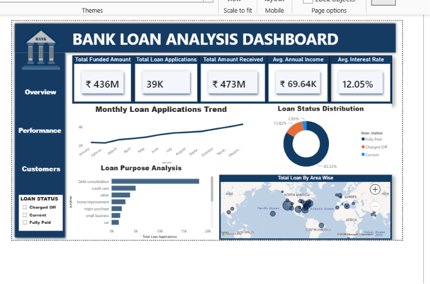
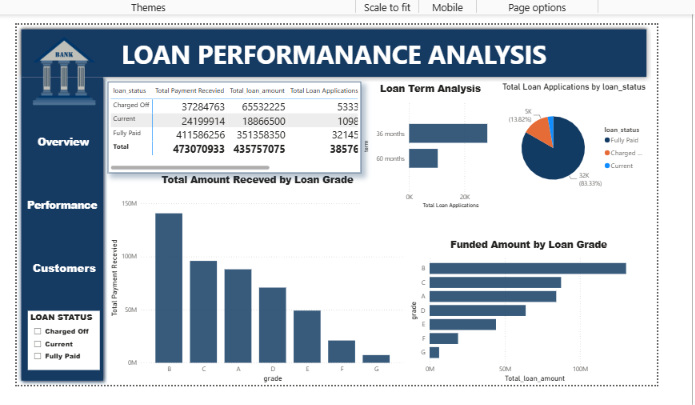
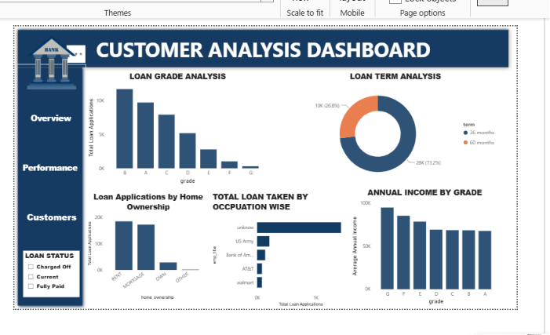
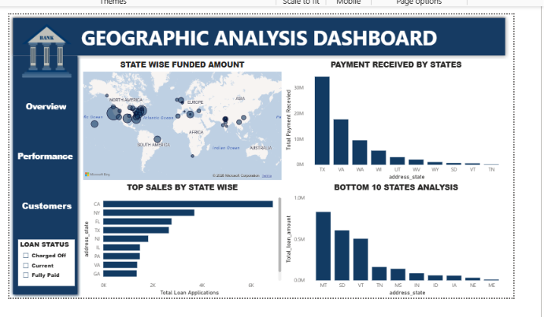

<p align="center">
  
</p>

<h1 align="center">🏦 Bank Loan Analysis Dashboard</h1>

<p align="center">

### End-to-End Data Analytics Project using Python, SQL, Power BI & Excel

</p>

---
# 📌 Project Overview

The Bank Loan Analysis Dashboard is an end-to-end Data Analytics project developed to analyze loan applications, customer profiles, funded amounts, repayments, and loan performance.

The project demonstrates the complete analytics workflow:

- Data Cleaning using Python
- Exploratory Data Analysis (EDA)
- SQL Data Analysis
- Interactive Power BI Dashboard
- Business Insights & Recommendations
- Professional Documentation

The dashboard enables business stakeholders to monitor loan performance, identify risky customers, and make data-driven lending decisions.

# 🎯 Business Problem

Banks receive thousands of loan applications every month. Without proper analysis, it becomes difficult to:

- Identify high-risk customers
- Monitor loan performance
- Track funded amounts
- Analyze customer demographics
- Improve lending decisions

This project provides an interactive dashboard that helps management monitor loan operations and make better business decisions.

# 🎯 Project Objectives

- Analyze loan applications and approvals.
- Track funded and received loan amounts.
- Evaluate customer demographics.
- Monitor loan status and repayment performance.
- Identify trends across states, employment, and loan purposes.
- Provide actionable business insights through dashboards.

- # 🛠️ Tools & Technologies

| Tool | Purpose |
|------|----------|
| 🐍 Python | Data Cleaning & Exploratory Data Analysis (EDA) |
| 🐼 Pandas | Data Manipulation |
| 📊 Matplotlib & Seaborn | Data Visualization |
| 🗄️ SQL (MySQL) | Data Querying & Business Analysis |
| 📈 Power BI | Interactive Dashboard Development |
| 📑 Microsoft Excel | Initial Data Understanding |
| 📝 VS Code & Jupyter Notebook | Coding Environment |
| 🌐 Git & GitHub | Version Control & Project Hosting |


# 📁 Repository Structure

```text
Bank-Loan-Analysis/
│
├── Data/
├── Images/
├── Power BI/
├── Presentation/
├── Python/
├── Report/
├── SQL/
└── README.md
```
# 📊 Dashboard Preview

## Executive Overview



---

## Loan Performance



---

## Customer Analysis



---

## Geographic Analysis



